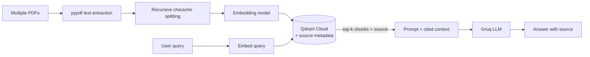

# RAG Systems

Three Retrieval-Augmented Generation (RAG) implementations, built incrementally to understand the mechanics of retrieval before relying on framework abstractions.

| | [`qdrant_vanille`](./qdrant_vanille) | [`try_text_RAG_system`](./try_text_RAG_system) | [`try_pdf_RAG_system`](./try_pdf_RAG_system) |
|---|---|---|---|
| **Focus** | Qdrant client basics (collections, upsert, query) | End-to-end RAG on a single text input | Multi-document RAG over PDFs |
| **Input** | N/A (Qdrant API exploration) | Plain text | Multiple PDF files |
| **Chunking** | — | Fixed-size with overlap | Recursive character splitting (LangChain) |
| **Orchestration** | Manual | Manual, no framework | LangChain |
| **Source tracking** | — | No | Yes (per-chunk metadata) |

## Why three separate projects?

Most RAG tutorials start with a framework and hide what's actually happening under the hood. I built these incrementally:

1. **`qdrant_vanille`** — first, isolated experiments with the Qdrant client itself (creating collections, upserting vectors, querying) before combining it with anything else.
2. **`try_text_RAG_system`** — a full RAG pipeline written without any orchestration framework, to understand every step: chunking, embedding, similarity search, prompt construction.
3. **`try_pdf_RAG_system`** — an evolution of the above to handle multiple real documents (PDFs), using LangChain's text splitter and adding source attribution.

## Shared tech stack

- **Language:** Python 3.12+
- **Package management:** [`uv`](https://docs.astral.sh/uv/)
- **Embeddings:** `sentence-transformers` (`all-MiniLM-L6-v2`, local inference, no API cost)
- **Vector database:** [Qdrant Cloud](https://cloud.qdrant.io/) (free tier)
- **LLM inference:** [Groq API](https://console.groq.com/) (free tier, Llama 3.3 70B)

## Architecture (try_pdf_RAG_system — most complete pipeline)



## Running locally

Each folder has its own README with exact setup steps. Common requirements:

1. A free [Qdrant Cloud](https://cloud.qdrant.io/) cluster
2. A free [Groq API](https://console.groq.com/) key
3. Python 3.12+ and [`uv`](https://docs.astral.sh/uv/) installed

```bash
git clone https://github.com/zerorchik/RAG-systems.git
cd RAG-systems/try_pdf_RAG_system   # or any other folder
uv sync
cp .env.example .env                # fill in your API keys
uv run main.py
```
