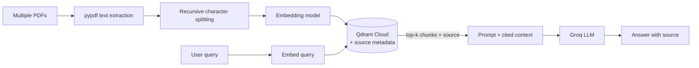

# try_pdf_RAG_system

A multi-document RAG pipeline over PDF files, built with LangChain's text splitters, source-aware metadata, and Qdrant Cloud as the vector store.

## How it works



1. **Ingestion** — every PDF in `documents/` is loaded and its text extracted with `pypdf`.
2. **Chunking** — text is split using LangChain's `RecursiveCharacterTextSplitter`, which tries to break on paragraph boundaries first, then lines, then sentences — before falling back to a hard character cut. This avoids severing a coherent section (e.g. a "Results" paragraph) the way naive fixed-size chunking does.
3. **Metadata enrichment** — each chunk keeps a `source` field (the originating filename), enabling both source-filtered search and answer citation.
4. **Retrieval & generation** — same as [`try_text_RAG_system`](../try_text_RAG_system), but the prompt includes the source of each chunk, and the LLM is instructed to cite which file its answer came from.

## Setup

```bash
uv sync
cp .env.example .env
```

Fill in `.env`:

```
QDRANT_URL=https://your-cluster.cloud.qdrant.io
QDRANT_API_KEY=your_key
GROQ_API_KEY=your_key
```

Add PDF files to `documents/`.

## Run

```bash
uv run main.py
```

## Example

```
Question: Який результат другої лабораторної?
Answer: [answer text]

Source: lab_2.pdf
```

## Key design decisions

- **Recursive character splitting over fixed-size** — preserves semantic coherence of chunks by respecting natural text boundaries (paragraphs → lines → sentences) instead of cutting at an arbitrary character count.
- **`chunk_size=1500`** rather than a smaller value — chosen so that a typical document section fits inside a single chunk without being split across two, which was empirically causing retrieval failures on smaller chunk sizes.
- **Source metadata in the vector payload** — required for any multi-document RAG system; without it there's no way to trace an answer back to its origin or filter search by document.

## Known limitations

- No reranking — retrieval relies purely on embedding similarity, which can be outperformed by a cross-encoder reranker for precision-sensitive queries.
- No handling for scanned/image-based PDFs — `pypdf` extracts embedded text only; OCR would be needed for scanned documents.
- Aggregation questions across the whole corpus (e.g. "how many documents are there") are unreliable with plain semantic retrieval — this is a known limitation of vector search, not a bug.
- Chunking uses a general-purpose recursive splitter rather than a structure-aware one, since document headings weren't consistent enough across files to split reliably by section title.
