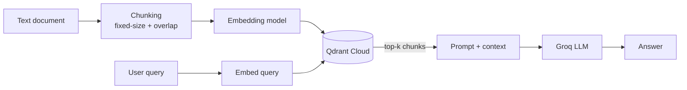

# try_text_RAG_system

A RAG pipeline built without any orchestration framework — every step (chunking, embedding, retrieval, prompt construction) is written explicitly to understand the mechanics before reaching for LangChain.

## How it works



1. **Chunking** — splits the source text into fixed-size chunks with overlap, so a sentence at a chunk boundary isn't lost.
2. **Embedding** — each chunk is converted into a 384-dimensional vector locally via `sentence-transformers` (`all-MiniLM-L6-v2`), no API calls, no cost.
3. **Storage & retrieval** — vectors are upserted into a Qdrant Cloud collection; a query is embedded the same way and matched via cosine similarity (`query_points`).
4. **Generation** — the top-k retrieved chunks are injected into a prompt that explicitly instructs the LLM to answer only from the given context, then sent to Groq's Llama 3.3 70B.

## Setup

```bash
uv sync
cp .env.example .env
```

Fill in `.env`:

```
QDRANT_URL=https://your-cluster.cloud.qdrant.io
QDRANT_API_KEY=your_key
GROQ_API_KEY=your_key
```

## Run

```bash
uv run main.py
```

The script builds the vector store from a sample text, then prompts for a question interactively.

## Example

```
Question: Скільки років татові?
Answer: Татові 36 років.
```

## Key design decisions

- **Cosine similarity** over Euclidean distance — standard choice for text embeddings, where direction matters more than magnitude.
- **Low temperature (0.2)** for generation — reduces hallucination risk by favoring grounded, deterministic answers over creative ones.
- **Local embeddings** instead of an embedding API — free, no rate limits, no network latency for this step.

## Known limitations

- Fixed-size chunking can split a semantically coherent section across two chunks if a natural boundary falls near the cutoff — this is what motivated the switch to recursive splitting in [`try_pdf_RAG_system`](../try_pdf_RAG_system).
- No source attribution — this pipeline works with a single document.
- Aggregation-style questions ("how many X are there") don't work well with plain semantic retrieval, since it retrieves by relevance, not by exhaustive scan.
